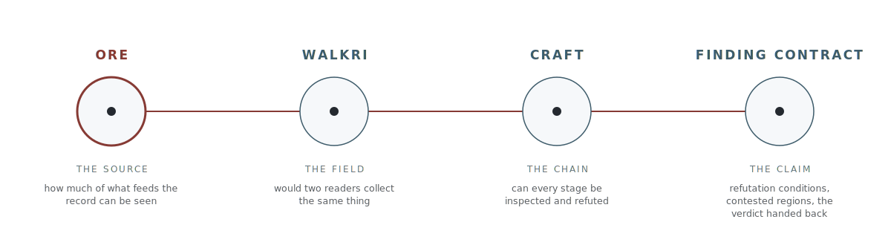

# ORE: Origin, Reliability, Exposure

A companion specification to [CRAFT](https://github.com/CrossWalkri/craft-meta-standard): what an evaluation chain is allowed to assume about what enters it. ORE is the chain's first legible commitment about its sources.

Every system that turns records into decisions has sources it did not create. ORE specifies what an honest account of a source must contain, and what a system is obligated to do differently when that account is thin. It grades uncertainty, never worth: a grade calibrates weight, monitoring, and eligible downstream use, and the judgment of whether the support suffices stays with the person reading the output.

<picture>
  <source media="(prefers-color-scheme: dark)" srcset="images/evidence-path-0_1_0-dark.svg">
  
</picture>

What only ORE does, in one line: grade source visibility as uncertainty, refuse to let party count impersonate independence, treat opacity without verdicts, and make every output wear the grade profile of what it rests on.

**[Read the specification](ore-specification-0_1_0.md)** (v0.1.0)

## What it specifies

- **Origin:** provenance integrity, whether an input came from where it claims, unchanged, and why strength there cannot stand in for anything else.
- **Reliability:** epistemic soundness and confirmation architecture (the four-case taxonomy of what confirmed a source's output, and why party count is not independence), with track record and independence as declared extension dimensions.
- **Exposure:** every output that rests on ingested material exposes the grade profile of its support. Nothing is silently laundered into a downstream judgment.

Plus **intake postures** (Screened, Graded, Open): systems legitimately differ in when grading happens and what ungraded material may touch; ORE requires the posture be declared, enforced, and recorded, not that any one posture be used.

## Relations

ORE inherits by reference from [CRAFT](https://github.com/CrossWalkri/craft-meta-standard) (the chain), [WALKRI](https://github.com/CrossWalkri) (the field: the paired instrument at the same boundary), the [Precision-First Design Standard](https://github.com/coordination-structural-integrity-suite/suite) (operational definability), and the [Information Asymmetry Classification Standard](https://github.com/coordination-structural-integrity-suite/suite) (the asymmetry taxonomy). It is independently adoptable: taking ORE requires taking nothing else.

CRAFT governs the chain end to end as process; the others sit at loci on it. **ORE** is the accounting discipline at the source boundary (not a stage before the chain: ingestion is the chain's first stage, and ORE specifies what may be assumed about the sources feeding it). **WALKRI** holds the intake fields, and **the finding**, the discipline for what an output must carry before anyone acts on it, binds the claim at exit; it publishes separately.

## License

CC0 1.0 Universal. No permission or fee, no attribution required. See [LICENSE](LICENSE).
