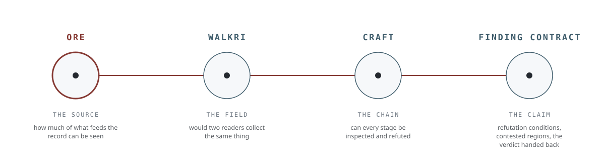

# ORE: Origin, Reliability, Exposure

A companion specification to [CRAFT](https://github.com/CrossWalkri/craft-meta-standard): what an evaluation chain is allowed to assume about what enters it. ORE is the chain's first legible commitment about its sources.

Every system that turns records into decisions has sources it did not create. ORE specifies what an honest account of a source must contain, and what a system is obligated to do differently when that account is thin. It grades uncertainty, never worth: a grade calibrates weight, monitoring, and eligible downstream use, and the judgment of whether the support suffices stays with the output's consumer, human or automated, never with the grade.

<picture>
  <source media="(prefers-color-scheme: dark)" srcset="images/evidence-path-0_1_0-dark.svg">
  
</picture>

What only ORE does, in one line: grade source visibility as uncertainty, refuse to let party count impersonate independence, treat opacity without verdicts, and make every output wear the grade profile of what it rests on.

**[Read the specification](ore-specification-0_1_2.md)** (v0.1.2)

## What it specifies

- **Origin:** provenance integrity, whether an input came from where it claims, unchanged, and why strength there cannot stand in for anything else.
- **Reliability:** epistemic soundness and confirmation architecture (the four-case taxonomy of what confirmed a source's output, and why party count is not independence), with track record and independence as declared extension dimensions.
- **Exposure:** every output that rests on ingested material exposes the grade profile of its support. Nothing is silently laundered into a downstream judgment.

Plus **intake postures** (Screened, Graded, Open): systems legitimately differ in when grading happens and what ungraded material may touch; ORE requires the posture be declared, enforced, and recorded, not that any one posture be used.

## What else is in this repository

- **The finding contract is now published as [STRUCK](https://github.com/CrossWalkri/STRUCK)** (v0.1.1), the exit-boundary standard, in its own repository. It is the output-side companion: the five obligations any evidence-grade output carries on its face. Graded evidence, refutation conditions, contested regions rather than averages, derivation chains walked to origin with labeled rungs, and the sufficiency judgment left with the consumer. The retired [`finding-contract-0_1_0.md`](finding-contract-0_1_0.md) file is kept in this repository so existing links keep resolving; the canonical home is the [STRUCK](https://github.com/CrossWalkri/STRUCK) repository.
- **[Prompts](ore-prompts-0_1_0.md)** (v0.1.0). Five copy-and-run prompts for any AI assistant, each self-contained: grade a source, check an evidence set for circular corroboration, produce a conformant finding, audit an existing finding, declare an intake posture. No tooling required.
- **[The Claude skill](claude-skills/claude-skill-ORE-0_1_0.md)** (v0.1.0). A procedural encoding of both specifications with a runtime sequence, so a partial task can be received and completed correctly.
- **[Benchmark case](ore-benchmark-case-0_1_0.md)** and **[key](ore-benchmark-key-0_1_0.md)** (v0.1.0). A fabricated twelve-source dossier with known ground truth, seeded with four integrity failures (circular corroboration, impossible provenance, a phantom entity merge, and a proxy attribution) and one genuine contested region that a pipeline must represent rather than resolve. Any system that turns claims into findings can be run against it and scored. The case and the key publish separately so the case can be run first, and the contamination limit is stated in both.

## Relations

ORE inherits by reference from [CRAFT](https://github.com/CrossWalkri/craft-meta-standard) (the chain), [WALKRI](https://github.com/CrossWalkri) (the field: the paired instrument at the same boundary), the [Precision-First Design Standard](https://github.com/coordination-structural-integrity-suite/suite) (operational definability), and the [Information Asymmetry Classification Standard](https://github.com/coordination-structural-integrity-suite/suite) (the asymmetry taxonomy). It is independently adoptable: taking ORE requires taking nothing else.

CRAFT governs the chain end to end as process; the others sit at loci on it. **ORE** is the accounting discipline at the source boundary (not a stage before the chain: ingestion is the chain's first stage, and ORE specifies what may be assumed about the sources feeding it). **WALKRI** holds the intake fields, and **[STRUCK](https://github.com/CrossWalkri/STRUCK)**, the exit-boundary standard for what an output must carry before anyone acts on it, binds the claim at exit.

The through line, stated once: every system that turns records into decisions has the same anatomy. Sources feed in material the system did not create, fields capture that material as data, and a chain of evaluation carries it to a claim someone acts on. Knowing begins honestly, or begins broken, in three places, and one standard stands at each: ORE at the source boundary, [WALKRI](https://github.com/CrossWalkri/WALKRI) at the field, [CRAFT](https://github.com/CrossWalkri/craft-meta-standard) over the whole path. One commitment runs through all three: no silent trust anywhere, and the worth-judgment left visible in the hands, human or automated, that make it. Each is independently adoptable; the through line is what they hold together.

As of CRAFT v0.4.4, a chain that ingests material it did not create carries an ingestion boundary declaration (CRAFT Section 6.1), satisfied by adopting ORE or by declaring equivalent obligations. Where ORE attaches to each of CRAFT's six conditions is mapped, condition by condition, in the **[ORE-to-CRAFT condition map](ore-craft-condition-map-0_1_0.md)**.

## License

CC0 1.0 Universal. No permission or fee, no attribution required. See [LICENSE](LICENSE).
